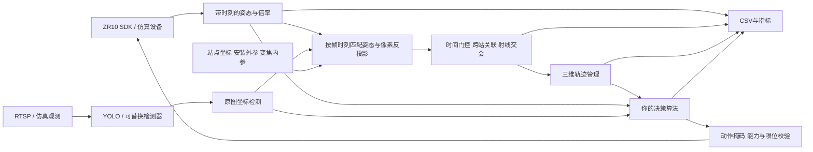

# 需求理解与架构设计

## 一、研究主体

你的目标不是让四台云台执行相同转动，而是让若干设备在动态任务中主动维持三维可观测性：发现目标，建立同目标多站观测，选择哪些设备负责哪些目标，执行可达的镜头指向，并在目标运动和可见性变化时连续维护其空间轨迹。

因此系统把“设备自身状态”“像面检测”“世界射线”“三维位置测量”“带身份的轨迹”和“下一步动作”建成不同类型。这能避免把本地像素追踪ID当跨设备ID，把单站目标方向当三维位置，或把预测点误记为本周期测量。

需求中的“市场中心”按“视场中心”理解。单目标 center 策略将各站光轴对准目标；到位是物理闭环逐步逼近的过程。定位层仍以实际检测像素和实际姿态计算，不能在尚未到位时谎称像素已经居中。multi 策略允许多目标同时在一个视场中，对每个像素单独反投影。

## 二、模块边界

所有关键模块使用普通 Python 类型和组合关系，不依赖一个巨大的父类。`Policy`、`Detector` 是稳定的替换接口。SDK 客户端仅存在硬件适配层；算法模块不导入 SDK，不接触 socket。

## 三、实时组织

硬件每台设备有独立连接监督、姿态读取、控制和看门狗任务。每次 API 调用有超时，断线采用退避重连；重连清除旧动作。一个设备的慢 ACK 不会让其他设备排队。运动命令区分“已发送”“收到协议 ACK”“实测到位”，三者不能互相替代。

每个视频解码器使用可终止的独立进程，防止 RTSP read 卡住导致退出失败。帧只保留最新值，推理使用后台线程串行共享模型实例，避免四套模型同时占用显存。不同推理部署可以通过 Detector 工厂替换。主决策计算运行在工作线程，事件循环保留给设备反馈和看门狗；CSV 由独立线程写盘。

Python、通用操作系统、网络相机和模型推理构成软实时系统。平台记录实际处理耗时、超期、视频帧龄、命令延迟和遥测龄。默认 10Hz 是调度目标，不是无条件吞吐保证。若增加设备/目标/模型复杂度，应先使用相同指标做负载测试，按需要降低检测分辨率、替换 ONNX/轻量模型、改变更新频率或将策略放入独立进程/服务。

## 四、能力分层

1. 设备能力层：是否核实该型号/固件支持该参数。
2. 实验动作层：当前实验允许算法改变哪些维度。
3. 参数合法性层：有限数值、限位、互斥命令、完整字段与标定范围。
4. 时间有效性层：动作租约与新鲜遥测。
5. 执行层：原子地完成参数检查后再发送；多条命令的网络执行不是事务，部分失败会记录实际已发送内容并停机。

`focal_length_mm` 是实测焦距表上的虚拟动作，设备最终执行倍率。名义焦距并不意味着 SDK 接受物理毫米单位，更不能假设 2 倍倍率必定正好等于两倍标定焦距。聚焦与倍率是不同变量。

## 五、旧版参考的取舍

旧版 ZIP 已作为代码参考读取，文档内容没有被当成当前任务的额外命令。旧版有效经验包括三台设备的 `.25～27` 地址、UDP37260、ZR10俯仰反馈归一化、独立速度方向符号、ACK stop、订阅失败回退轮询，以及CSV线程。

旧版主要是同步动作步骤验证，`NullObservationProvider` 返回空观测；没有实际三维相机模型、跨相机关联、空间定位和轨迹闭环。新项目因此使用独立包名 `zr10lab`，重新定义数据契约，并增加第4台设备，而不是在同步步骤类里叠加一切功能。原压缩包与旧日志未被修改，也未混入新平台的实验结果。

## 六、来源与核验记录

核验日期：2026-09-06～07。固定 SDK 源码与哈希保存在 `vendor/SOURCE.json`，MIT 许可证随源码提供。

- [用户指定 SDK v2 分支](https://github.com/mzahana/siyi_sdk/tree/siyi-sdk-v2)：核验 `connect_udp`、`SIYIClient`、models 和命令编码实现。
- [SDK client.py](https://github.com/mzahana/siyi_sdk/blob/siyi-sdk-v2/siyi_sdk/client.py)：绝对角度、速度、反馈、变焦、关闭等实际调用接口。
- [SDK 视频说明](https://github.com/mzahana/siyi_sdk/blob/siyi-sdk-v2/docs/streaming.md)：ZR10旧代视频地址与视频后端。
- [ZR10 中文技术参数](https://www.siyi.biz/zh/product/tri-axis-single-camera-gimbal/zr10/spec/)：该页面给出的俯仰范围为 -90°～+25°，水平 -160°～+160°；1倍水平FOV61.5°，10倍7°。
- [ZR10 英文技术参数](https://www.siyi.biz/en/product/tri-axis-single-camera-gimbal/zr10/spec/)：英文页面俯仰、视场值与中文页不同。因此配置使用保守的实验角度范围与可替换标定值。
- [官方手册与协议下载](https://www.siyi.biz/zh/product/tri-axis-single-camera-gimbal/zr10/download/)：现场固件兼容性应以实际硬件及对应版本为准。
- [OpenCV 相机标定文档](https://docs.opencv.org/4.x/d9/d0c/group__calib3d.html)：棋盘格、畸变与像素投影。
- [Gymnasium API](https://gymnasium.farama.org/api/env/)：reset/step、终止与截断契约。

SDK README 曾把 rotate 描述成0.1度步进，但实际命令是整数速度等级；本实现以源码为准。set_attitude的ACK是接收时姿态，不代表已到目标角。SDK注释中的聚焦近远方向存在冲突，本项目要求实测协议方向，不根据冲突注释擅自固定物理含义。当前 encoding 接口不发送 fps，因此平台明确拒绝该字段。

## 七、后续扩展的优先级

- 使用实测姿态速度曲线、变焦响应和镜头畸变/中心变化替换仿真近似。
- 用外观embedding或专门的无人机时序模型改善同类交叉目标的身份连续性。
- 更严格的采集时间标定与有可信曝光时刻的接收后端，用于快速目标高精度定位。
- 把几何协方差、持续定位率、切换次数、能耗/转动量等作为多目标优化或学习奖励。
- 基于现有 Policy 接口接入集中式训练、分布式执行，或外部优化服务；保持 CSV 与观测契约不变。

这些是扩展方向，不表示当前已实现相应识别模型、硬件同步器或经过训练的学习策略。
